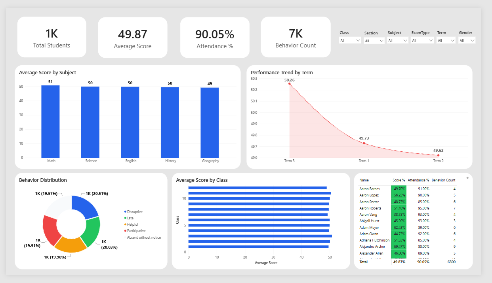
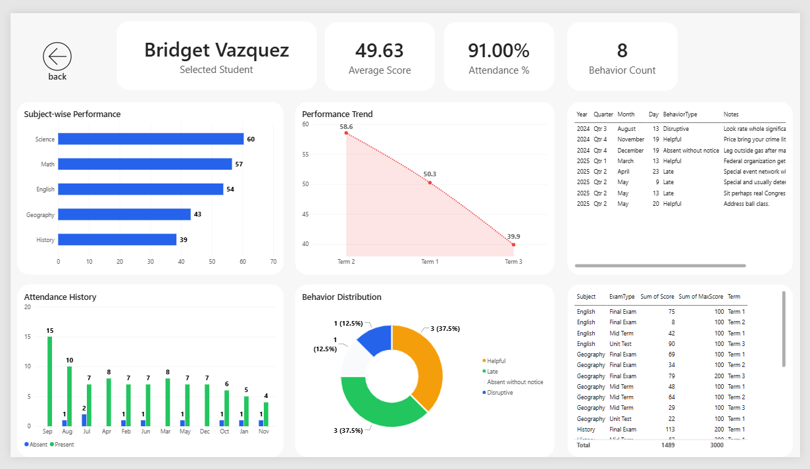
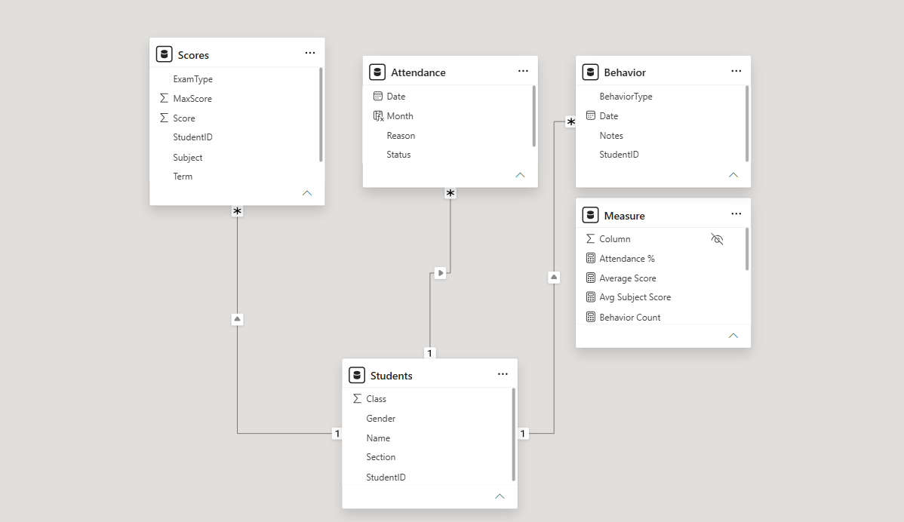
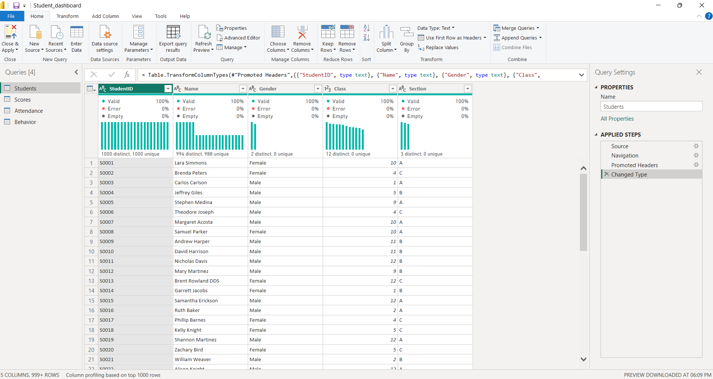
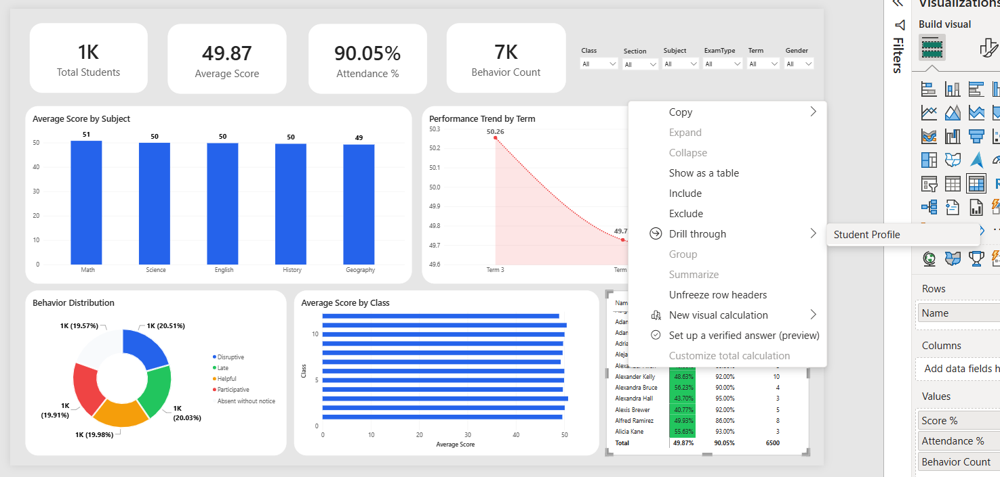
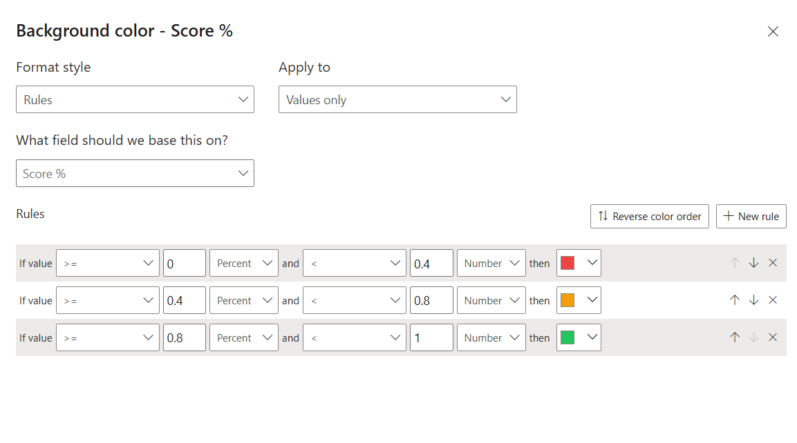
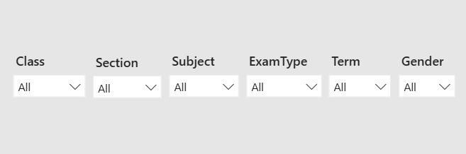

# 🎓 Student Performance Analytics Dashboard

<p align="center">


</p>

---

# 📌 Project Overview

The **Student Performance Analytics Dashboard** is an interactive Power BI project developed to analyze student academic performance, attendance records, and behavioral activities.

The dashboard enables teachers, school administrators, and management teams to identify performance trends, monitor attendance, evaluate behavior patterns, and analyze student progress through interactive reports.

---

# 📷 Dashboard Preview

## 🏠 Academic Dashboard



---

## 👨‍🎓 Student Profile



---

# 🚀 Features

### 📊 Performance Analysis

- Subject-wise Performance
- Class-wise Performance
- Average Score
- Performance Trend
- KPI Cards

---

### 📅 Attendance Analysis

- Attendance Percentage
- Attendance History
- Attendance Trend

---

### 😊 Behavior Analysis

- Behavior Distribution
- Behavior Records
- Behavior Count

---

### 🎯 Interactive Features

- Dynamic Slicers
- Drillthrough Pages
- Conditional Formatting
- Interactive Filters
- Cross Filtering
- Responsive Dashboard

---

# 📈 Dashboard KPIs

| KPI | Description |
|------|-------------|
| 👨 Total Students | Total Students in School |
| 📖 Average Score | Overall Academic Performance |
| ✅ Attendance % | Student Attendance Rate |
| 😊 Behavior Count | Total Behavior Records |

---

# 📊 Dashboard Visualizations

| Visualization | Purpose |
|---------------|----------|
| KPI Cards | Overall Metrics |
| Clustered Column Chart | Subject-wise Average Score |
| Line Chart | Performance Trend |
| Bar Chart | Class-wise Comparison |
| Donut Chart | Behavior Distribution |
| Matrix | Student Performance |
| Slicers | Dynamic Filtering |

---

# 📂 Dataset

The project uses four different datasets.

| Dataset | Description |
|----------|-------------|
| Students | Student Information |
| Scores | Academic Scores |
| Attendance | Attendance Records |
| Behavior | Student Behavior |

---

# 🧮 DAX Measures

```DAX
Total Students =
DISTINCTCOUNT(Students[StudentID])
```

```DAX
Average Score =
AVERAGE(Scores[Score])
```

```DAX
Attendance % =
DIVIDE(
CALCULATE(
COUNTROWS(Attendance),
Attendance[Status]="Present"),
COUNTROWS(Attendance)
)
```

```DAX
Behavior Count =
COUNTROWS(Behavior)
```

---

# 🔗 Data Model

The dashboard follows a Star Schema data model.



---

# ⚡ Data Cleaning

Data cleaning was performed using **Power Query**.

Tasks Performed

- Data Type Conversion
- Null Value Handling
- Data Validation
- Relationship Preparation



---

# 🎯 Drillthrough Analysis

A dedicated Student Profile page allows users to drill down into individual student performance.

### Includes

- Student Details
- Subject Performance
- Attendance History
- Behavior Records



---

# 🎨 Conditional Formatting

Student performance is highlighted using dynamic colors.

| Performance | Color |
|------------|-------|
| Above 80% | 🟢 Green |
| 40% - 80% | 🟡 Yellow |
| Below 40% | 🔴 Red |



---

# 🎛 Interactive Filters

Users can dynamically filter reports by

- Class
- Section
- Subject
- Gender
- Term



---

# 🛠 Tools Used

- Microsoft Power BI
- Power Query
- DAX
- Excel

---

# 📁 Repository Structure

```
Student-Performance-Dashboard
│
├── Images
│   ├── dashboard-overview.png
│   ├── student-profile.png
│   ├── data-model.png
│   ├── power-query.png
│   ├── drillthrough.png
│   ├── conditional-formatting.png
│   └── filters.png
│
├── Dataset
│   ├── Students.xlsx
│   ├── Scores.xlsx
│   ├── Attendance.xlsx
│   └── Behavior.xlsx
│
├── Student_Performance_Dashboard.pbix
│
└── README.md
```

---

# 💡 Key Insights

- Academic performance can be analyzed subject-wise and class-wise.
- Attendance trends help identify students with low attendance.
- Behavioral analysis highlights discipline patterns.
- Drillthrough provides detailed student-level insights.
- Interactive filters improve dashboard usability.

---

# ⭐ Skills Demonstrated

✔ Power BI

✔ Data Modeling

✔ Power Query

✔ DAX

✔ Data Visualization

✔ Dashboard Design

✔ Drillthrough

✔ Conditional Formatting

✔ Interactive Reporting

---

# 👨‍💻 Author

**Maulik Baldaniya**

📧 maulikbaldaniya001@gmail.com

🔗 LinkedIn

https://www.linkedin.com/in/maulik-baldaniya-795174262/

🔗 GitHub

https://github.com/mkbaldaniya

---

## ⭐ If you found this project useful, consider giving it a Star!
