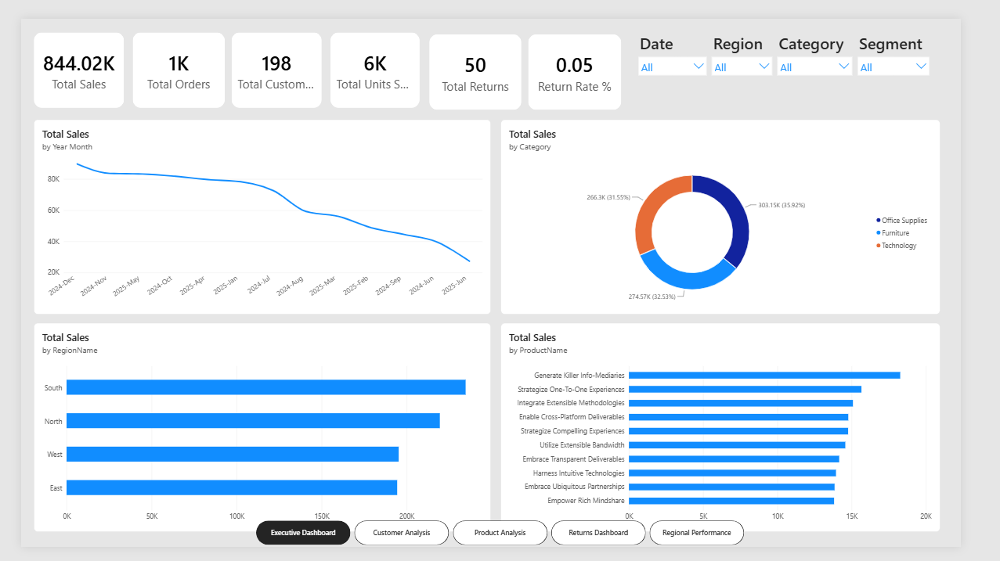
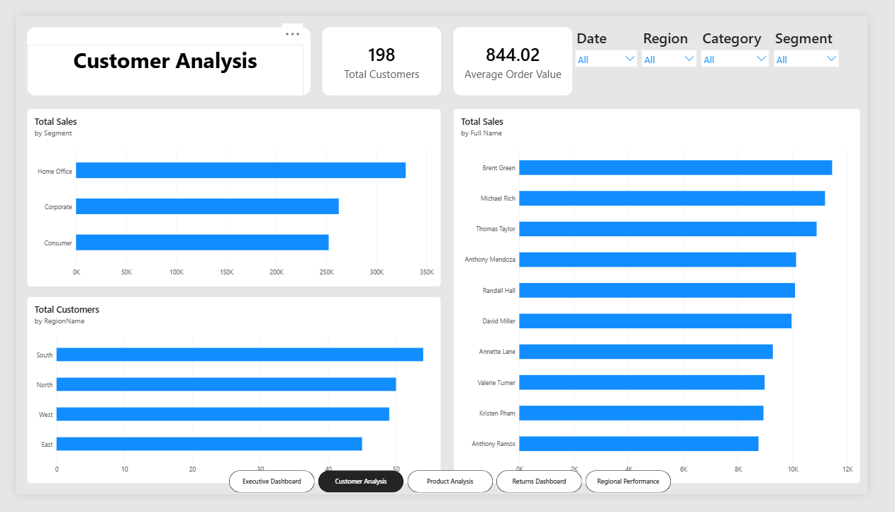
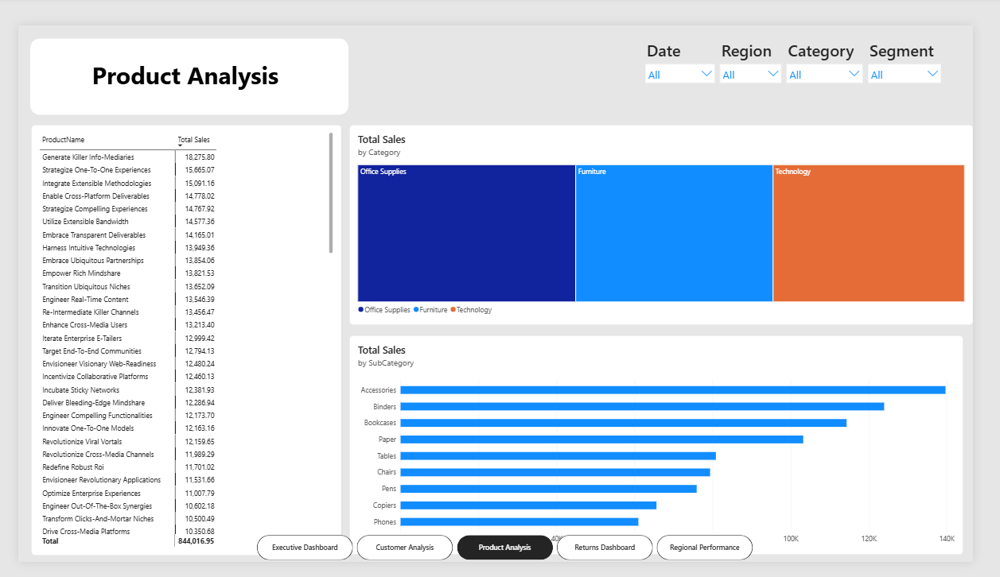
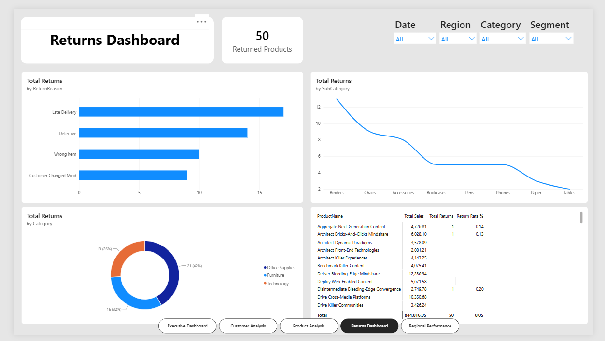
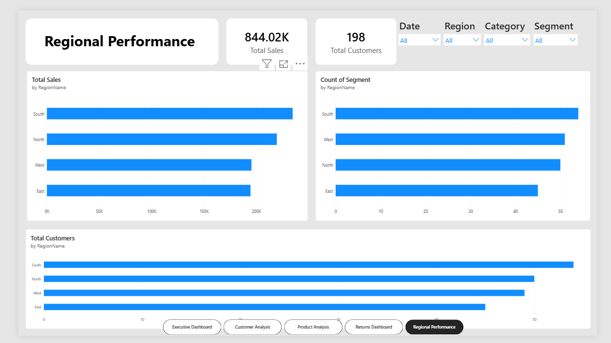

# 📊 Sales & Customer Intelligence Dashboard

## Overview

A comprehensive Power BI dashboard designed to analyze Sales Performance, Customer Behavior, Product Performance, Returns Analysis, and Regional Insights using an interactive multi-page reporting solution.

---

## Executive Dashboard



Key Metrics:

* Total Sales
* Total Orders
* Total Customers
* Total Units Sold
* Total Returns
* Return Rate %

Visuals:

* Sales Trend Analysis
* Sales by Category
* Sales by Region
* Top 10 Products by Sales

---

## Customer Analysis



Key Metrics:

* Total Customers
* Average Order Value

Visuals:

* Sales by Customer Segment
* Top Customers by Sales
* Customers by Region

---

## Product Analysis



Visuals:

* Product Sales Ranking
* Category Performance
* Sub-Category Analysis

---

## Returns Dashboard



Visuals:

* Return Reason Analysis
* Returns by Category
* Product Return Analysis
* Return Rate Matrix

---

## Regional Performance



Visuals:

* Regional Sales Analysis
* Regional Customer Analysis
* Segment Distribution by Region

---

## Dataset Tables

* Date_Dim
* Customer_Dim
* Product_Dim
* Sales_Fact
* Returns_Fact
* Region_Dim

---

## DAX Measures

```DAX
Total Sales
Total Orders
Total Customers
Total Units Sold
Total Returns
Return Rate %
Average Order Value
Returned Products
Sales YTD
Sales PY
YOY %
MOM %
```

---

## Features

✅ Star Schema Data Model

✅ Time Intelligence Calculations

✅ Interactive Slicers

✅ Multi-Page Navigation

✅ KPI Cards

✅ Drill-through Analysis

✅ Mobile Layout Support

---

## Tools Used

* Power BI Desktop
* DAX
* Power Query
* Excel

---

## Author

**Maulik Baldaniya**

GitHub: https://github.com/mkbaldaniya

LinkedIn: https://www.linkedin.com/in/maulik-baldaniya-795174262
